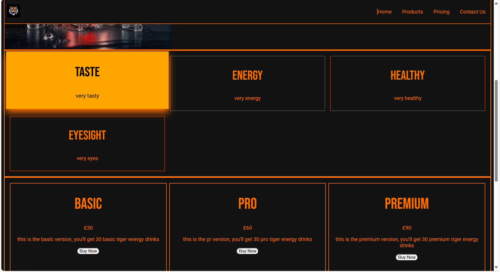

# TIGER ENERGY Project

This project is a product site for a fake energy brand tiger energy. This uses all previous knowledge to make a professional looking site. It also has my first Javascript script for the nav bar.

## Technologies Used
- HTML
- CSS
- JS

## Features
- Responsive design using Flexbox
- grid cards
- Contact Form
- Responsive navigation bar

## Screenshot

## How to Run
1. Clone the repository
2. Open index.html in your browser
